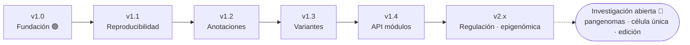

<!--
  CONVENCIÓN DE MANTENIMIENTO
  - Este roadmap se AÑADE, no se reescribe: cada hito entregado se conserva como historia.
  - Estados permitidos: ✅ Entregado · 🟢 Actual · 🎯 Objetivo · 🔭 Largo plazo · 🧪 Investigación.
  - Al liberar una versión: marca su fila de la tabla como ✅/🟢 y tacha (~~…~~) los ítems descartados en vez de borrarlos.
  - No cambies los títulos de sección (`## vX.Y — …`): son anclas usadas por la tabla de navegación.
  - La fuente ejecutable del estado por módulo es registry/modules.json; este documento es la lectura humana.
-->

# 🗺️ Roadmap

> No es un compromiso de fechas: es un **orden de prioridades**. Las capacidades avanzan por madurez y evidencia, no por calendario. Una función solo sube de madurez cuando existe validación suficiente (ver [Definición de terminado](DEFINITION_OF_DONE.md) y [Modelo de evidencia](EVIDENCE_MODEL.md)).

Estado vivo por módulo: [PROJECT_STATUS](PROJECT_STATUS.md) · Cambios liberados: [CHANGELOG](../CHANGELOG.md) · Cómo se decide: [Proceso RFC](RFC_PROCESS.md)

## Navegación

| Hito | Estado | Foco principal |
|---|---|---|
| [v1.0 — Fundación evolutiva](#v10--fundación-evolutiva) | 🟢 Actual | Núcleo verificable, contratos, módulos, formatos |
| [v1.1 — Reproducibilidad de datasets](#v11--reproducibilidad-de-datasets) | 🎯 Objetivo | Manifiestos, checksums, trazabilidad de ejecución |
| [v1.2 — Anotaciones y transcritos](#v12--anotaciones-y-transcritos) | 🎯 Objetivo | Modelo gene/transcript/exón/CDS |
| [v1.3 — Variantes interoperables](#v13--variantes-interoperables) | 🎯 Objetivo | Normalización, multialélicos, export VCF |
| [v1.4 — API de módulos](#v14--api-de-módulos) | 🎯 Objetivo | Descubrimiento y ejecución por contrato |
| [v2.x — Regulación y epigenómica](#v2x--regulación-y-epigenómica) | 🔭 Largo plazo | BED/bedGraph, metilación, cromatina |
| [Investigación abierta](#investigación-abierta) | 🧪 Investigación | Pangenomas, célula única, 3D/4D, edición |

---

## v1.0 — Fundación evolutiva

**Estado: 🟢 Actual — entregado.** Establece la plataforma; no declara finalizada la genómica.

- [x] 🧾 Contratos científicos `ScientificResult<T>` y coordenadas 0-based half-open
- [x] 🗂️ Registro de módulos y capacidades con madurez, evidencia y limitaciones
- [x] 📚 Base científica dividida por dominios y compilada como bundle
- [x] 🧬 Perfiles de organismo y compartimento
- [x] 📄 Lectores FASTA, GFF3 y VCF (alcance inicial)
- [x] 🧪 Núcleo de secuencias: traducción, ORF, variantes sobre CDS, G-cuádruplex
- [x] 🖥️ CLI científica, laboratorio web (PWA) y juego educativo
- [x] 🧭 Plantillas, RFCs, roadmap, versionado y criterios de promoción de madurez
- [x] 📦 Distribución web precompilada e integridad por checksums

## v1.1 — Reproducibilidad de datasets

**Estado: 🎯 Objetivo.** Hacer que cualquier análisis sea re-ejecutable y trazable.

- [ ] 🧾 Manifiestos por dataset y artefacto (accesión, fecha, licencia)
- [ ] 💾 Caché local y reanudación de descargas
- [ ] 🔐 Validación de checksums y licencias de fuentes externas
- [ ] 📋 Metadatos de ejecución exportables (comando, hash de entrada, parámetros)

Relacionado: [Reproducibilidad](REPRODUCIBILITY.md) · [Fuentes de datos](DATA_SOURCES.md)

## v1.2 — Anotaciones y transcritos

**Estado: 🎯 Objetivo.** Pasar de secuencias aisladas a estructura génica.

- [ ] 🧬 Modelo gene / transcript / exón / CDS
- [ ] 🔗 Integración GFF3 + FASTA
- [ ] 🧫 Consecuencias moleculares por isoforma
- [ ] ✅ Pruebas con regiones pequeñas conocidas

Relacionado: [Formatos de archivo](FILE_FORMATS.md) · [Análisis de variantes](VARIANT_ANALYSIS.md)

## v1.3 — Variantes interoperables

**Estado: 🎯 Objetivo.** Variantes que dialoguen con el ecosistema bioinformático.

- [ ] ⬅️ Normalización izquierda de variantes
- [ ] 🧮 Soporte de multialélicos y genotipos
- [ ] 🎚️ Filtros de calidad
- [ ] 📤 Exportación VCF compatible

## v1.4 — API de módulos

**Estado: 🎯 Objetivo.** Consumir capacidades por contrato, no por acoplamiento.

- [ ] 🔎 Descubrimiento programático de módulos y capacidades
- [ ] ⚙️ Ejecución por contrato (`ScientificResult<T>`)
- [ ] 🔌 Adaptadores CLI/web sobre la misma API
- [ ] 🧯 Aislamiento de módulos experimentales

Relacionado: [Sistema de módulos](MODULE_SYSTEM.md) · [Contrato de resultados](SCIENTIFIC_RESULT_CONTRACT.md)

## v2.x — Regulación y epigenómica

**Estado: 🔭 Largo plazo.** Requiere formatos y validación adicionales antes de comprometerse.

- [ ] 🧷 Formatos BED y bedGraph, pistas genómicas
- [ ] 🎛️ Promotores y enhancers
- [ ] 🔬 Metilación y estado de cromatina

## Investigación abierta

**Estado: 🧪 Investigación — sin fecha cerrada.** Su ingreso depende de RFC, datos y validación reproducible.

- [ ] 🕸️ Pangenomas en grafo (coordenadas, haplotipos, rutas)
- [ ] 🧊 Genómica 3D/4D
- [ ] 🔵 Célula única y transcriptómica espacial
- [ ] 🧩 Estructuras no canónicas (benchmarks contra conjuntos publicados)
- [ ] ✂️ Edición genómica

Contexto: [Fronteras de investigación](RESEARCH_FRONTIERS.md) · [Estructuras no canónicas](NONCANONICAL_STRUCTURES.md)

---

## 🚫 No-objetivos (explícito)

Para proteger la credibilidad científica, la plataforma **no** pretende:

- **Diagnóstico ni interpretación clínica.** Las predicciones computacionales no equivalen a evidencia funcional.
- **Reemplazar pipelines especializados** (VEP, GATK, ClinVar, alineadores, ensambladores).
- **Presentar predicciones como hechos.** Todo resultado declara su nivel de evidencia y limitaciones.
- **Cerrar el campo.** Es una plataforma para incorporar investigación con madurez explícita, no un producto definitivo.

## 💬 Cómo influir en el roadmap

1. Abre un issue con el prefijo `proposal:` describiendo el problema científico, no solo la solución.
2. Para cambios de contrato o de modelo de datos, sigue el [Proceso RFC](RFC_PROCESS.md).
3. Revisa los [criterios de promoción de madurez](DEFINITION_OF_DONE.md) antes de proponer subir un módulo de `experimental` a `validated`.
4. Consulta [CONTRIBUTING](../CONTRIBUTING.md) para el flujo de contribución.
